# 📊 AWS Service Report Generator


Automated AWS Lambda function that generates Excel reports from AWS infrastructure data. Processes data from the [aws-infrastructure-fetcher](https://github.com/jxman/aws-infrastructure-fetcher) project and creates comprehensive Excel reports with region, service, and availability information.

> **Part of the AWS Infrastructure Suite**: This project consumes data produced by [aws-infrastructure-fetcher](https://github.com/jxman/aws-infrastructure-fetcher), which collects AWS region and service data daily at 2 AM UTC.

## Features

- **Automated Daily Reports**: Triggers automatically when new AWS infrastructure data is available
- **Comprehensive Excel Reports**: 4 detailed sheets with rich formatting and color-coding
  - Summary with EST/EDT timestamps
  - Regions with service counts and formatted dates
  - Services with regional coverage metrics and percentage calculations
  - Service Coverage matrix with visual availability indicators (✓/✗)
- **Smart Retention**: Latest report always available + 7-day archive with automatic cleanup
- **Email Notifications**: Success/failure notifications with emojis and detailed metrics
- **Data Quality**: Missing values displayed as "N/A" in gray italic, consistent date formatting
- **Production-Ready**: Error handling, retry logic, structured logging, and CloudWatch alarms

## Architecture

```mermaid
architecture-beta
    group input(logos:aws-s3)[Data Input]
    group processing(logos:aws-lambda)[Report Processing]
    group output(logos:aws)[Output Services]

    service s3input(logos:aws-s3)[S3 Source Data] in input
    service lambda(logos:aws-lambda)[Lambda Report Generator] in processing
    service s3output(logos:aws-s3)[S3 Reports Output] in output
    service sns(logos:aws-sns)[SNS Notifications] in output

    s3input:R -- L:lambda
    lambda:R -- L:s3output
    lambda:R -- L:sns
```



## Prerequisites

- **AWS SAM CLI** installed ([installation guide](https://docs.aws.amazon.com/serverless-application-model/latest/developerguide/install-sam-cli.html))
- **AWS CLI** configured with appropriate credentials
- **Node.js 20.x** installed locally
- **Existing S3 bucket** (`aws-data-fetcher-output`) with AWS infrastructure data

## Quick Start

### 1. Install Dependencies

```bash
cd src
npm install
cd ..
```

### 2. Validate SAM Template

```bash
sam validate
```

### 3. Build Application

```bash
sam build
```

### 4. Deploy (First Time)

```bash
sam deploy --guided
```

Follow the prompts:
- **Stack Name**: `aws-service-report-generator`
- **AWS Region**: `us-east-1` (or your preferred region)
- **Parameter SourceBucketName**: `aws-data-fetcher-output`
- **Parameter NotificationEmail**: `your-email@example.com`
- **Confirm changes before deploy**: `Y`
- **Allow SAM CLI IAM role creation**: `Y`
- **Save arguments to configuration file**: `Y`

### 5. Confirm SNS Subscription

Check your email and click the confirmation link to receive notifications.

### 6. Configure S3 Event Trigger

After deployment, run the command from the CloudFormation outputs:

```bash
# Get the command from stack outputs
aws cloudformation describe-stacks \
  --stack-name aws-service-report-generator \
  --query 'Stacks[0].Outputs[?OutputKey==`S3EventConfigurationCommand`].OutputValue' \
  --output text
```

Then execute the returned command to enable automatic S3 triggers.

### 7. Test Manual Invocation

```bash
aws lambda invoke \
  --function-name aws-service-report-generator \
  --payload '{}' \
  response.json

cat response.json
```

### 8. Verify Reports

```bash
# Check latest report
aws s3 ls s3://aws-data-fetcher-output/reports/

# Check archive
aws s3 ls s3://aws-data-fetcher-output/reports/archive/

# Download latest report
aws s3 cp s3://aws-data-fetcher-output/reports/aws-service-report-latest.xlsx ./
```

## Excel Report Structure

### Sheet 1: Summary
High-level metadata and statistics with Eastern Time timestamps
- **Report Generated**: Current timestamp in EST/EDT format (YYYY-MM-DD HH:mm:ss EST/EDT)
- **Data Source**: S3 path to source data
- **Schema Version**: Data contract version
- **Data Timestamp**: Source data timestamp in EST/EDT format
- **Statistics**: Total regions, services, and service-by-region mappings

### Sheet 2: Regions
Complete list of 38 AWS regions with service availability
- **Region Code**: AWS region identifier (e.g., us-east-1)
- **Region Name**: Full region name
- **Availability Zones**: Number of AZs in each region
- **Service Count**: Number of services available in the region
- **Launch Date**: Region launch date (YYYY-MM-DD format)
- **Blog URL**: Clickable hyperlink to AWS blog announcement
- _Missing data shown as "N/A" in gray italic_

### Sheet 3: Services
All 395 AWS services alphabetically sorted with regional coverage metrics
- **Service Code**: AWS service identifier (e.g., s3, ec2, lambda)
- **Service Name**: Full AWS service name
- **Available Regions**: Count of regions where service is available (out of 38)
- **Coverage %**: Percentage coverage across all regions
  - 🟢 **100%**: Green bold (available everywhere)
  - 🟢 **75-99%**: Light green (broad availability)
  - 🟠 **50-74%**: Orange (moderate availability)
  - 🔴 **1-49%**: Red (limited availability)
  - ⚪ **0%**: Gray italic (not available)

### Sheet 4: Service Coverage
Comprehensive matrix showing service availability by region
- **Layout**: 395 services (rows) × 38 regions (columns) = 15,010 cells
- **Available**: Green checkmark (✓)
- **Not Available**: Red X (✗)
- **Features**: Frozen headers, auto-filter, sortable columns

## S3 Bucket Structure

```
aws-data-fetcher-output/
├── aws-data/
│   └── complete-data.json         (Source data - updated daily at 2 AM UTC)
└── reports/
    ├── aws-service-report-latest.xlsx       (Current report - overwritten daily)
    └── archive/
        ├── aws-service-report-2025-10-14-020500.xlsx
        ├── aws-service-report-2025-10-13-020500.xlsx
        └── ... (7 days retained, older automatically deleted)
```

## Email Notifications

### Success Notification
```
✅ AWS Service Report Generation Complete

📊 Report Details
• Generated: 2025-10-16 10:53:26 EDT
• Processing Time: 4.1 seconds
• Excel Generation: 3.4 seconds
• Report Size: 65.61 KB

📁 Report Locations
Latest Report: s3://aws-data-fetcher-output/reports/aws-service-report-latest.xlsx
Archive Report: s3://aws-data-fetcher-output/reports/archive/aws-service-report-2025-10-16-145326.xlsx

📈 Data Summary
• AWS Regions: 38
• AWS Services: 395
• Service-by-Region Mappings: 8,643
• Data Schema: 1.4.0
• Data Timestamp: 2025-10-15 22:00:10 EDT

📁 Archive Management
• Reports Retained: 7
• Reports Deleted: 0
```

### Failure Notification
```
❌ AWS Service Report Generation Failed

⚠️ Error Details
• Error Type: SourceFileNotFound
• Error Message: S3 source file not found

🔍 Troubleshooting Steps
1. Verify the source file exists in S3
2. Check aws-infrastructure-fetcher Lambda execution logs
3. Verify data fetcher completed successfully at 2 AM UTC
```

## Development

### Update Code

```bash
# Make changes to src/*.js files
# Then rebuild and redeploy

sam build
sam deploy
```

### View Logs

```bash
# Tail logs in real-time
sam logs --tail --stack-name aws-service-report-generator

# View specific time range
sam logs --start-time '10min ago' --stack-name aws-service-report-generator
```

### CloudWatch Logs

```bash
# View logs in AWS Console
aws logs tail /aws/lambda/aws-service-report-generator --follow
```

## Monitoring

### CloudWatch Alarms

Two alarms are configured:
1. **Error Alarm**: Triggers on any Lambda errors (1 day period)
2. **Timeout Warning**: Triggers if execution approaches timeout (>4 minutes)

Both alarms send SNS notifications to the configured email.

### CloudWatch Metrics

Standard Lambda metrics:
- **Invocations**: Total executions
- **Duration**: Execution time
- **Errors**: Failed invocations
- **Throttles**: Rate-limited invocations

## Troubleshooting

### Report Not Generated

1. **Check S3 source file exists**:
   ```bash
   aws s3 ls s3://aws-data-fetcher-output/aws-data/complete-data.json
   ```

2. **Check Lambda execution logs**:
   ```bash
   aws logs tail /aws/lambda/aws-service-report-generator --follow
   ```

3. **Check SNS subscription**:
   ```bash
   aws sns list-subscriptions-by-topic \
     --topic-arn $(aws cloudformation describe-stacks \
       --stack-name aws-service-report-generator \
       --query 'Stacks[0].Outputs[?OutputKey==`ReportNotificationsTopicArn`].OutputValue' \
       --output text)
   ```

### No Email Notifications

1. Confirm SNS subscription (check email for confirmation link)
2. Check spam/junk folder
3. Verify topic ARN in Lambda environment variables

### S3 Event Not Triggering

1. Run the S3 event configuration command (from deployment outputs)
2. Verify Lambda has permission to be invoked by S3
3. Check S3 bucket notification configuration:
   ```bash
   aws s3api get-bucket-notification-configuration \
     --bucket aws-data-fetcher-output
   ```

## Cost Estimate

**~$0.21/month** for daily reports (30/month):
- Lambda: < $0.01
- S3 Storage & API: < $0.03
- SNS: < $0.01
- CloudWatch Logs: < $0.01
- CloudWatch Alarms: $0.20 (primary cost driver)

## Cleanup

To remove all resources:

```bash
sam delete --stack-name aws-service-report-generator
```

**Note**: This will NOT delete the S3 bucket or reports. To delete reports:

```bash
aws s3 rm s3://aws-data-fetcher-output/reports/ --recursive
```

## Related Projects

- **Data Source**: [aws-infrastructure-fetcher](https://github.com/jxman/aws-infrastructure-fetcher)
- **Data Contract**: [DATA_CONTRACT.md](https://github.com/jxman/aws-infrastructure-fetcher/blob/main/DATA_CONTRACT.md)

## License

ISC

## Author

jxman
