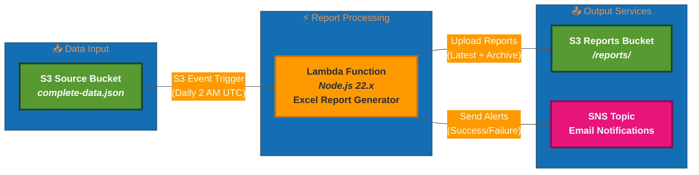

# 📊 AWS Service Report Generator


Automated AWS Lambda function that generates Excel reports from AWS infrastructure data. Processes data from the [aws-infrastructure-fetcher](https://github.com/jxman/aws-infrastructure-fetcher) project and creates comprehensive Excel reports with region, service, and availability information.

> **Part of the AWS Infrastructure Suite**: This project consumes data produced by [aws-infrastructure-fetcher](https://github.com/jxman/aws-infrastructure-fetcher), which collects AWS region and service data daily at 2 AM UTC.

## Features

- **Automated Daily Reports**: Triggers automatically when new AWS infrastructure data is available
- **Comprehensive Excel Reports**: 4 detailed sheets with rich formatting and color-coding
  - Summary with EST/EDT timestamps
  - Regions with service counts and formatted dates
  - Services with regional coverage metrics and percentage calculations
  - Service Coverage matrix with visual availability indicators (✓/✗)
- **Smart Retention**: Latest report always available + 7-day archive with automatic cleanup
- **Public Distribution**: Automatic copying to public S3 bucket (`www.aws-services.synepho.com`) for web access (with 5-minute cache)
- **Email Notifications**: Success/failure notifications with emojis and detailed metrics
- **Data Quality**: Missing values displayed as "N/A" in gray italic, consistent date formatting
- **Production-Ready**: Error handling, retry logic, structured logging, and CloudWatch alarms

## Architecture



## How It Works

### Automated Trigger (Primary Method)

The Lambda function is **automatically triggered** by S3 event notifications:

1. The `aws-infrastructure-fetcher` Lambda runs daily at **2:00 AM UTC**
2. It uploads fresh AWS infrastructure data to `s3://aws-data-fetcher-output/aws-data/complete-data.json`
3. S3 detects the file upload (ObjectCreated event) and automatically invokes this Lambda function
4. The function generates the Excel report (~4 seconds)
5. Reports are uploaded to `s3://aws-data-fetcher-output/reports/`
6. SNS sends an email notification with results

**Requirements for automation:**
- ✅ S3 bucket must have event notification configured (see Step 6 in Quick Start)
- ✅ Lambda function must have permission to be invoked by S3
- ✅ Source data must be uploaded to the correct S3 path

### Manual Trigger (Testing/On-Demand)

You can also manually invoke the function anytime:

```bash
aws lambda invoke \
  --function-name aws-service-report-generator \
  --payload '{}' \
  response.json
```

**Use cases:**
- Testing after code changes
- Generating reports on-demand
- Troubleshooting issues
- Refreshing report with current timestamp

### Trigger Verification

**Check if S3 event notification is configured:**
```bash
aws s3api get-bucket-notification-configuration \
  --bucket aws-data-fetcher-output
```

**Check recent Lambda executions:**
```bash
aws logs tail /aws/lambda/aws-service-report-generator --since 24h
```

## Prerequisites

- **GitHub repository** with this code
- **AWS Account** with appropriate permissions
- **Existing S3 bucket** (`aws-data-fetcher-output`) with AWS infrastructure data
- **GitHub Actions** configured with OIDC (see Deployment section)

**For local testing only:**
- **AWS SAM CLI** installed ([installation guide](https://docs.aws.amazon.com/serverless-application-model/latest/developerguide/install-sam-cli.html))
- **Node.js 22.x** installed locally

## Deployment

### Deployment Policy - GitHub Actions Only

**CRITICAL: All infrastructure deployments MUST use GitHub Actions workflows. Local deployment is for testing only.**

#### Why GitHub Actions is Mandatory:
- **Security**: Uses OIDC authentication instead of long-lived AWS credentials
- **Audit Trail**: Complete deployment history and logging
- **Consistency**: Standardized deployment environment
- **Team Visibility**: All deployments tracked and visible
- **Best Practices**: Infrastructure deployed through CI/CD, never from local machines

### GitHub Actions OIDC Security Implementation

This project implements **best-practice OIDC authentication** with complete repository isolation:

#### Project-Specific IAM Resources
- **IAM Role**: `GithubActionsOIDC-AWSServicesReporter-Role`
- **IAM Policy**: `GithubActions-AWSServicesReporter-Policy`
- **Repository Restriction**: Only this specific repository can assume the role
- **OIDC Provider**: GitHub-specific with official thumbprints

#### Security Features
- ✅ **Repository isolation**: Trust policy restricted to this specific repository
- ✅ **Least privilege**: IAM permissions scoped to only required resources
- ✅ **Project-specific naming**: No conflicts with other repositories
- ✅ **Resource restrictions**: Permissions limited to project-specific AWS resources
- ✅ **No long-lived credentials**: Uses OIDC web identity federation

### Required Deployment Method

Deploy infrastructure changes using GitHub Actions:

```bash
# Trigger deployment by pushing to main branch
git add .
git commit -m "Description of changes"
git push origin main

# OR manually trigger the workflow
gh workflow run "Deploy SAM Application" --ref main

# Monitor deployment progress
gh run list --limit 5
gh run view [RUN_ID]

# View deployment in browser
gh run view [RUN_ID] --web
```

### Initial Setup (One-Time)

#### 1. Configure GitHub OIDC (If Not Already Done)

The OIDC infrastructure should already be deployed. If setting up from scratch, see the archived Terraform configuration in `archived/terraform/github-oidc/` for reference.

#### 2. Add GitHub Secret

Add the AWS role ARN as a GitHub secret:

```bash
# Get the role ARN (from OIDC Terraform outputs or AWS Console)
gh secret set AWS_ROLE_ARN --body "arn:aws:iam::ACCOUNT_ID:role/GithubActionsOIDC-AWSServicesReporter-Role"
```

#### 3. Confirm SNS Subscription (After First Deployment)

Check your email and click the confirmation link to receive notifications.

#### 4. Configure S3 Event Trigger (CRITICAL)

**⚠️ This is a required one-time setup step for automatic daily report generation.**

The S3 bucket needs to be configured to automatically trigger the Lambda function when new data files are uploaded. Without this configuration, reports will only run when manually invoked.

#### What This Does
Configures the S3 bucket `aws-data-fetcher-output` to send event notifications to the Lambda function whenever `complete-data.json` is created or updated. This enables automatic daily report generation when the `aws-infrastructure-fetcher` runs at 2 AM UTC.

#### Setup Steps

**Step 1: Get the configuration command from CloudFormation stack outputs**
```bash
aws cloudformation describe-stacks \
  --stack-name aws-service-report-generator \
  --query 'Stacks[0].Outputs[?OutputKey==`S3EventConfigurationCommand`].OutputValue' \
  --output text
```

This returns a pre-formatted `aws s3api put-bucket-notification-configuration` command with the correct Lambda ARN and permissions.

**Step 2: Execute the returned command**
Copy and run the command returned from Step 1. It will look similar to:
```bash
aws s3api put-bucket-notification-configuration \
  --bucket aws-data-fetcher-output \
  --notification-configuration '{...}'
```

#### Verify Configuration

Check that the S3 event notification is configured:
```bash
aws s3api get-bucket-notification-configuration \
  --bucket aws-data-fetcher-output
```

You should see a `LambdaFunctionConfigurations` section with:
- **Events**: `["s3:ObjectCreated:*"]`
- **Filter**: `{"Key": {"FilterRules": [{"Name": "prefix", "Value": "aws-data/"}, {"Name": "suffix", "Value": "complete-data.json"}]}}`
- **LambdaFunctionArn**: Points to your report generator function

#### How It Works
```
Daily at 2 AM UTC:
aws-infrastructure-fetcher runs
    ↓
Uploads complete-data.json to S3
    ↓
S3 detects ObjectCreated event
    ↓
S3 automatically invokes Lambda function
    ↓
Report generated and uploaded
    ↓
SNS email notification sent
```

### Local Testing Only

**Important**: Local SAM commands are for testing purposes only. Never use these for production deployments.

#### Build and Test Locally

```bash
# Install dependencies
cd src
npm install
cd ..

# Validate SAM template
sam validate --lint

# Build application
sam build

# Test manual invocation locally (requires AWS credentials)
sam local invoke ReportGeneratorFunction --event test-event.json
```

#### Manual Lambda Invocation (Testing)

For quick testing of deployed function:

```bash
aws lambda invoke \
  --function-name aws-service-report-generator \
  --payload '{}' \
  response.json

cat response.json
```

#### Verify Reports

```bash
# Check latest report
aws s3 ls s3://aws-data-fetcher-output/reports/

# Check archive
aws s3 ls s3://aws-data-fetcher-output/reports/archive/

# Download latest report
aws s3 cp s3://aws-data-fetcher-output/reports/aws-service-report-latest.xlsx ./
```

## Excel Report Structure

### Sheet 1: Summary
High-level metadata and statistics with Eastern Time timestamps
- **Report Generated**: Current timestamp in EST/EDT format (YYYY-MM-DD HH:mm:ss EST/EDT)
- **Data Source**: S3 path to source data
- **Schema Version**: Data contract version
- **Data Timestamp**: Source data timestamp in EST/EDT format
- **Statistics**: Total regions, services, and service-by-region mappings

### Sheet 2: Regions
Complete list of 38 AWS regions with service availability
- **Region Code**: AWS region identifier (e.g., us-east-1)
- **Region Name**: Full region name
- **Availability Zones**: Number of AZs in each region
- **Service Count**: Number of services available in the region
- **Launch Date**: Region launch date (YYYY-MM-DD format)
- **Blog URL**: Clickable hyperlink to AWS blog announcement
- _Missing data shown as "N/A" in gray italic_

### Sheet 3: Services
All 395 AWS services alphabetically sorted with regional coverage metrics
- **Service Code**: AWS service identifier (e.g., s3, ec2, lambda)
- **Service Name**: Full AWS service name
- **Available Regions**: Count of regions where service is available (out of 38)
- **Coverage %**: Percentage coverage across all regions
  - 🟢 **100%**: Green bold (available everywhere)
  - 🟢 **75-99%**: Light green (broad availability)
  - 🟠 **50-74%**: Orange (moderate availability)
  - 🔴 **1-49%**: Red (limited availability)
  - ⚪ **0%**: Gray italic (not available)

### Sheet 4: Service Coverage
Comprehensive matrix showing service availability by region
- **Layout**: 395 services (rows) × 38 regions (columns) = 15,010 cells
- **Available**: Green checkmark (✓)
- **Not Available**: Red X (✗)
- **Features**: Frozen headers, auto-filter, sortable columns

## S3 Bucket Structure

### Source & Report Bucket (aws-data-fetcher-output)
```
aws-data-fetcher-output/
├── aws-data/
│   └── complete-data.json         (Source data - updated daily at 2 AM UTC)
└── reports/
    ├── aws-service-report-latest.xlsx       (Current report - overwritten daily)
    └── archive/
        ├── aws-service-report-2025-10-14-020500.xlsx
        ├── aws-service-report-2025-10-13-020500.xlsx
        └── ... (7 days retained, older automatically deleted)
```

### Distribution Bucket (Enabled)
The latest report is automatically copied to a public distribution bucket:
```
www.aws-services.synepho.com/
└── reports/
    └── aws-service-report-latest.xlsx   (Publicly accessible with 5-minute cache)
```

**Distribution Details:**
- **Enabled and Active**: Automatically copies after each report generation
- Uses S3 CopyObject for fast, server-side copying
- Sets `cache-control: public, max-age=300` (5-minute cache for CDN/browser)
- Non-critical operation: failures are logged but don't stop report generation
- Serves reports via S3 static website hosting accessible at CloudFront CDN

## Email Notifications

### Success Notification
```
✅ AWS Service Report Generation Complete

📊 Report Details
• Generated: 2025-10-16 10:53:26 EDT
• Processing Time: 4.1 seconds
• Excel Generation: 3.4 seconds
• Report Size: 65.61 KB

📁 Report Locations
Latest Report: s3://aws-data-fetcher-output/reports/aws-service-report-latest.xlsx
Archive Report: s3://aws-data-fetcher-output/reports/archive/aws-service-report-2025-10-16-145326.xlsx

📈 Data Summary
• AWS Regions: 38
• AWS Services: 395
• Service-by-Region Mappings: 8,643
• Data Schema: 1.4.0
• Data Timestamp: 2025-10-15 22:00:10 EDT

📁 Archive Management
• Reports Retained: 7
• Reports Deleted: 0
```

### Failure Notification
```
❌ AWS Service Report Generation Failed

⚠️ Error Details
• Error Type: SourceFileNotFound
• Error Message: S3 source file not found

🔍 Troubleshooting Steps
1. Verify the source file exists in S3
2. Check aws-infrastructure-fetcher Lambda execution logs
3. Verify data fetcher completed successfully at 2 AM UTC
```

## Configuration

### Distribution Configuration

**Current Configuration (Active):**
- Distribution Bucket: `www.aws-services.synepho.com`
- Distribution Key: `reports/aws-service-report-latest.xlsx`
- Cache-Control: `public, max-age=300` (5 minutes)
- Status: ✅ Enabled and working

**Check current configuration:**
```bash
aws lambda get-function-configuration \
  --function-name aws-service-report-generator \
  --query 'Environment.Variables.{DISTRIBUTION_BUCKET: DISTRIBUTION_BUCKET, DISTRIBUTION_KEY: DISTRIBUTION_KEY}' \
  --output json
```

**To disable distribution:**
```bash
aws cloudformation update-stack \
  --stack-name aws-service-report-generator \
  --use-previous-template \
  --parameters \
    ParameterKey=SourceBucketName,UsePreviousValue=true \
    ParameterKey=NotificationEmail,UsePreviousValue=true \
    ParameterKey=DistributionBucketName,ParameterValue='' \
    ParameterKey=DistributionKeyPath,UsePreviousValue=true \
  --capabilities CAPABILITY_IAM
```

### Change Distribution Cache Duration

The default cache-control is `public, max-age=300` (5 minutes). To change this, edit `src/archiveManager.js` and update the `CacheControl` value in the `distributeReports()` function.

## Development

### Update Code

```bash
# Make changes to src/*.js files
# Commit and push to trigger deployment

git add .
git commit -m "Description of changes"
git push origin main

# GitHub Actions will automatically:
# 1. Run tests and linting
# 2. Validate SAM template
# 3. Build application
# 4. Deploy to AWS (on main branch only)
```

### Local Testing Before Push

```bash
# Install dependencies
cd src
npm install
npm run lint
npm test
cd ..

# Validate and build
sam validate --lint
sam build

# Test locally (optional)
sam local invoke ReportGeneratorFunction --event test-event.json
```

### View Logs

```bash
# Tail logs in real-time
sam logs --tail --stack-name aws-service-report-generator

# View specific time range
sam logs --start-time '10min ago' --stack-name aws-service-report-generator
```

### CloudWatch Logs

```bash
# View logs in AWS Console
aws logs tail /aws/lambda/aws-service-report-generator --follow
```

## Monitoring

### CloudWatch Alarms

Two alarms are configured:
1. **Error Alarm**: Triggers on any Lambda errors (1 day period)
2. **Timeout Warning**: Triggers if execution approaches timeout (>4 minutes)

Both alarms send SNS notifications to the configured email.

### CloudWatch Metrics

Standard Lambda metrics:
- **Invocations**: Total executions
- **Duration**: Execution time
- **Errors**: Failed invocations
- **Throttles**: Rate-limited invocations

## Troubleshooting

### Report Not Generated

1. **Check S3 source file exists**:
   ```bash
   aws s3 ls s3://aws-data-fetcher-output/aws-data/complete-data.json
   ```

2. **Check Lambda execution logs**:
   ```bash
   aws logs tail /aws/lambda/aws-service-report-generator --follow
   ```

3. **Check SNS subscription**:
   ```bash
   aws sns list-subscriptions-by-topic \
     --topic-arn $(aws cloudformation describe-stacks \
       --stack-name aws-service-report-generator \
       --query 'Stacks[0].Outputs[?OutputKey==`ReportNotificationsTopicArn`].OutputValue' \
       --output text)
   ```

### No Email Notifications

1. Confirm SNS subscription (check email for confirmation link)
2. Check spam/junk folder
3. Verify topic ARN in Lambda environment variables

### S3 Event Not Triggering Lambda

**Symptom**: Reports are not generated automatically when `aws-infrastructure-fetcher` uploads new data at 2 AM UTC.

#### Diagnostic Steps

**1. Verify S3 event notification is configured**
```bash
aws s3api get-bucket-notification-configuration \
  --bucket aws-data-fetcher-output
```

Expected output should include:
```json
{
  "LambdaFunctionConfigurations": [
    {
      "Id": "InvokeReportGenerator",
      "LambdaFunctionArn": "arn:aws:lambda:us-east-1:ACCOUNT:function:aws-service-report-generator",
      "Events": ["s3:ObjectCreated:*"],
      "Filter": {
        "Key": {
          "FilterRules": [
            {"Name": "prefix", "Value": "aws-data/"},
            {"Name": "suffix", "Value": "complete-data.json"}
          ]
        }
      }
    }
  ]
}
```

If empty or missing, run the configuration command from CloudFormation stack outputs (see Step 6 in Quick Start).

**2. Check if source data file exists and is being updated**
```bash
# Check if file exists
aws s3 ls s3://aws-data-fetcher-output/aws-data/complete-data.json

# Check last modified timestamp
aws s3api head-object \
  --bucket aws-data-fetcher-output \
  --key aws-data/complete-data.json \
  --query 'LastModified' \
  --output text
```

**3. Verify Lambda has S3 invoke permissions**
Check Lambda function policy:
```bash
aws lambda get-policy \
  --function-name aws-service-report-generator \
  --query 'Policy' \
  --output text | jq '.'
```

Should include a statement allowing `s3.amazonaws.com` to invoke the function.

**4. Test manual Lambda invocation**
```bash
aws lambda invoke \
  --function-name aws-service-report-generator \
  --payload '{}' \
  response.json && cat response.json
```

If manual invocation works but S3 trigger doesn't, the S3 event notification configuration is the issue.

#### Resolution

**Option 1: Reconfigure S3 event notification**
```bash
# Get the configuration command
aws cloudformation describe-stacks \
  --stack-name aws-service-report-generator \
  --query 'Stacks[0].Outputs[?OutputKey==`S3EventConfigurationCommand`].OutputValue' \
  --output text

# Execute the returned command
```

**Option 2: Manually configure (if CloudFormation output not available)**
See [AWS S3 Event Notification Documentation](https://docs.aws.amazon.com/AmazonS3/latest/userguide/notification-how-to-event-types-and-destinations.html) for manual configuration steps.

#### Prevention
- Do not modify S3 bucket notification configuration outside of this deployment
- The S3 bucket can only have one notification configuration; adding others may overwrite this setup
- Verify configuration after any infrastructure changes to the S3 bucket

## Cost Estimate

**~$0.21/month** for daily reports (30/month):
- Lambda: < $0.01
- S3 Storage & API: < $0.03
- SNS: < $0.01
- CloudWatch Logs: < $0.01
- CloudWatch Alarms: $0.20 (primary cost driver)

## Cleanup

To remove all resources, use AWS CLI (the stack can be deleted manually):

```bash
# Delete the CloudFormation stack
aws cloudformation delete-stack --stack-name aws-service-report-generator

# Monitor deletion progress
aws cloudformation describe-stacks --stack-name aws-service-report-generator
```

**Note**: This will NOT delete the S3 bucket or reports. To delete reports:

```bash
aws s3 rm s3://aws-data-fetcher-output/reports/ --recursive
```

**Security Cleanup**: The OIDC IAM resources (`GithubActionsOIDC-AWSServicesReporter-Role` and `GithubActions-AWSServicesReporter-Policy`) are managed separately via Terraform in `archived/terraform/github-oidc/` and should be retained if deploying other projects with the same security model.

## Related Projects

- **Data Source**: [aws-infrastructure-fetcher](https://github.com/jxman/aws-infrastructure-fetcher)
- **Data Contract**: [DATA_CONTRACT.md](https://github.com/jxman/aws-infrastructure-fetcher/blob/main/DATA_CONTRACT.md)

## License

ISC

## Author

jxman
